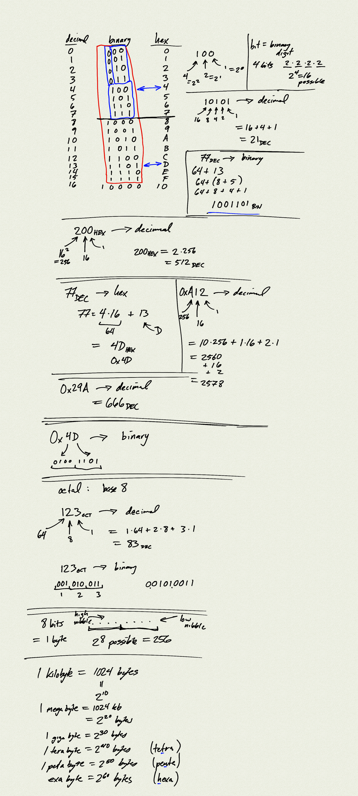

## Command line

- navigating directories
- creating directories
- creating / editing files
- copying / moving files and directories
- running Python programs
- compiling and running Java programs

## Counting in binary

* binary
* hexadecimal
* octal

[Assignment](Unit0_Assignment)

[pdf](notes.pdf)

<iframe class="video" src="https://www.youtube.com/embed/mgc5pNr5E5E" title="YouTube video player" frameborder="0" allow="accelerometer; autoplay; clipboard-write; encrypted-media; gyroscope; picture-in-picture" allowfullscreen></iframe>

