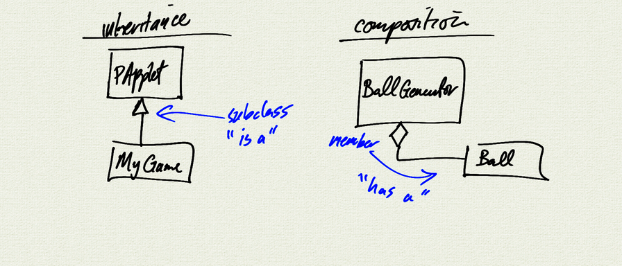

Topics:
- class relationships
    - inheritance == 'is a'
    - composition == 'has a'
- interacting classes
- computations on member lists
 
[Assignment](Unit13_Assignment)

[Cat.java](demo/Cat.java)  
[CatCollection.java](demo/CatCollection.java)  

```java
```

```java
```


[Ball.java](BallDemo/Ball.java)   
[BallGenerator.java](BallDemo/BallGenerator.java)   
[BallDemo.java](BallDemo/BallDemo.java)  

[notes (pdf)](notes.pdf)  
  


<iframe width="560" height="315" src="https://www.youtube.com/embed/cy0EiD7h0Lo" title="YouTube video player" frameborder="0" allow="accelerometer; autoplay; clipboard-write; encrypted-media; gyroscope; picture-in-picture" allowfullscreen></iframe>


