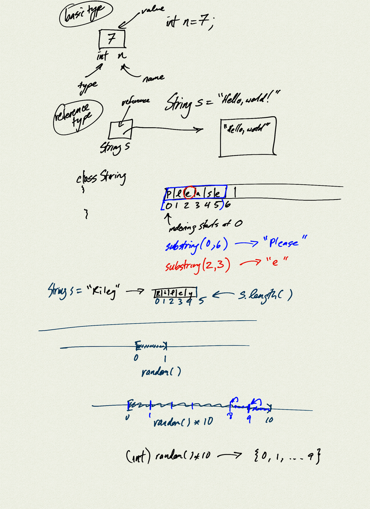

Topics:

- class `Math`
    - `PI`, `E`
    - `sin()`, `cos()`, `exp()`
    - `random()`
    - `abs()`, floating point equality comparisons

- class `String`
    - String objects and return values
    - concatenation
    - reference types, comparison, `equals()` 
    - `length()`, `substring()`


[Assignment](Unit3_Assignment)


[HelloMath.java](demo/HelloMath.java)

```java
```


[HelloString.java](demo/HelloString.java)

```java
```


[HelloRandom.java](demo/HelloRandom.java)

```java
```




[pdf](notes.pdf)

<iframe class="video" src="https://www.youtube.com/embed/On6-2h0FYok" title="YouTube video player" frameborder="0" allow="accelerometer; autoplay; clipboard-write; encrypted-media; gyroscope; picture-in-picture" allowfullscreen></iframe>

