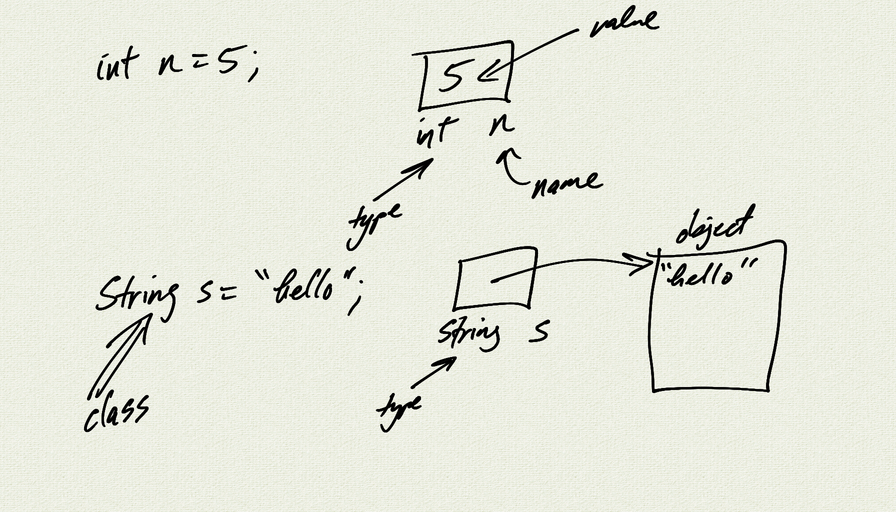

Topics:
- class definitions
- member variables and methods
- public/private, static
- constructor

[Assignment](Unit5_Assignment)

[Person demo](demo_person)  
[PiggyBank demo](demo_piggy_bank)  
[CoinFlipper demo](demo_coin_flipper)   
[Circle demo](demo_circle)  

<iframe class="video" src="https://www.youtube.com/embed/ZY0leCj2zec" title="YouTube video player" frameborder="0" allow="accelerometer; autoplay; clipboard-write; encrypted-media; gyroscope; picture-in-picture" allowfullscreen></iframe>

