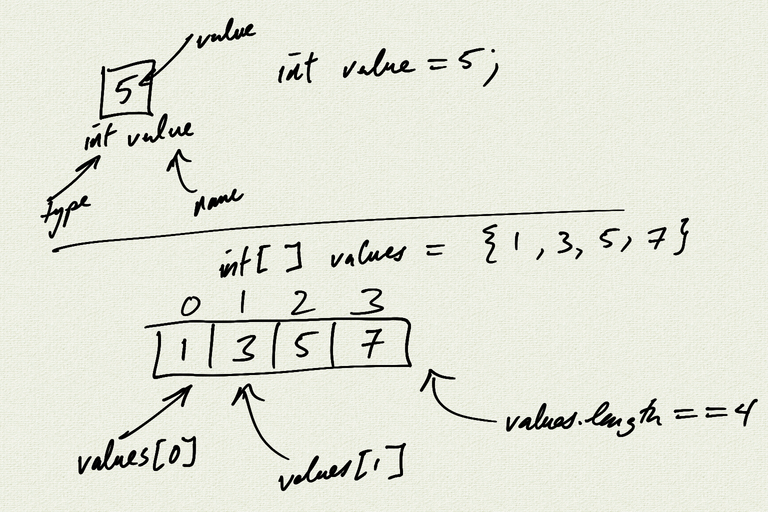

Topics:
- declaring, initializing, and accessing arrays
- for loops vs for each loops
- example loop calculations (counting, sums)

[Assignment](Unit7_Assignment)

[notes (pdf)](notes.pdf)


[HelloArrays.java](HelloArrays.java)

```java

```
<iframe class="video" src="https://www.youtube.com/embed/k-e6i5nI64A" title="YouTube video player" frameborder="0" allow="accelerometer; autoplay; clipboard-write; encrypted-media; gyroscope; picture-in-picture" allowfullscreen></iframe>

